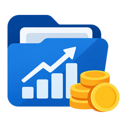

# Portfolio Assets

<p align="center">
  
</p>

Portfolio Assets tracks investments in Home Assistant. Each asset has its own
device showing its current price, the amount you own, and its total value.

## What it does

The integration creates one device for each cryptocurrency, ETF, or fund in
your portfolio. It also creates a Portfolio device with combined totals and
changes over time.

Prices can be retrieved from Binance, Börse Frankfurt, and Wiener Börse OeKB.
Brief invalid readings are ignored, and unusually large changes are confirmed
before replacing the last reliable price.

## Install with HACS

[](https://my.home-assistant.io/redirect/hacs_repository/?owner=gabbro246&repository=portfolio_assets&category=integration)

1. Select the button above from a device where you are signed in to Home
   Assistant, then confirm the repository in HACS.
2. In HACS, download **Portfolio Assets**.
3. Restart Home Assistant.
4. Go to **Settings → Devices & services**, choose **Add integration**, and
   search for **Portfolio Assets**.

You need [HACS](https://hacs.xyz/) installed first. If the button cannot open
your Home Assistant, add `https://github.com/gabbro246/portfolio_assets` in
HACS as an **Integration** repository instead.

## Set up your portfolio

Add your assets to `configuration.yaml`, then restart Home Assistant. This
example tracks Bitcoin through Binance:

```yaml
portfolio_assets:
  update_interval: 1800
  change_windows_days: [1, 7]
  assets:
    - asset_id: btc
      name: Bitcoin
      kind: crypto
      source: binance
      instrument: BTCEUR
      amount_unit: BTC
```

Configuration options:

- `asset_id`: A short unique identifier, such as `btc` or `eunl`.
- `name`: The name shown in Home Assistant.
- `kind`: `crypto`, `etf`, or `fund`.
- `source`: `binance`, `boerse_frankfurt`, or `wienerboerse_oekb`.
- `instrument`: A Binance symbol, an ISIN, or a full Wiener Börse quote URL.
- `amount_unit`: The unit shown beside the amount, such as `BTC` or `EUNL`.
- `change_windows_days`: The periods for matching Change and Delta entities,
  such as `1` and `7` days.

For Börse Frankfurt assets, you can also set `mic`; it defaults to `XETR`.
The portfolio refreshes every 30 minutes by default. Change `update_interval`
to use a different number of seconds.

After restarting Home Assistant, enter how much of each asset you own on its
device page. Add more asset blocks to the YAML list whenever needed.

## Manual installation

Copy `custom_components/portfolio_assets` into the `custom_components`
directory in your Home Assistant configuration, then restart Home Assistant.

## License

[MIT](LICENSE)
